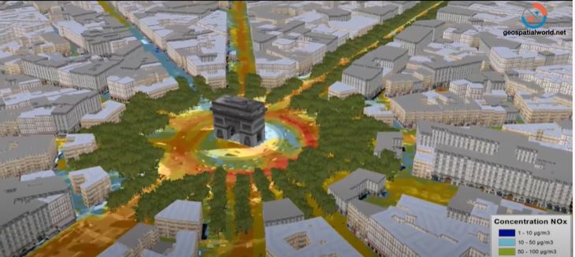

# LIDER ETL

Lidar Example 3d


**Table of contents**

- [Overview](#overview)
- [Experiments](#experiments)
- [Tests](#tests)

<hr>

## Introduction

> <p>This is about how water flows through a maize farm field. This knowledge will help us improve our research on new agricultural products being tested on farms.</p>
> <p> We would like to know which parts of the farm are likely to produce more or less maize, so that if we try a new fertilizer on part of this farm, we have more confidence that any differences in the maize harvest are due mostly to the new fertilizer changes, and not just random effects due to other environmental factors.</p>
> <p>We are tasked to produce an easy to use, reliable and well designed python module that domain experts and data scientists can use to fetch, visualise, and transform publicly available satellite and LIDAR data. In particular, our code should interface with USGS 3DEP and fetch data using their API.</p>

<hr>

## Overview

> In this project I took data using API provided by USGS_3DEP ( United States Geological Survey 3D Elevation Program). AgriTech is a company working on maize farms and this project is done for the study of maize farms for water flow across different geographical areas. Extraction, Visualization and transformation of data were achieved in this project.

## Requirements

- PDAL
- Geopandas

## Install

```
git clone hhttps://github.com/Ammon21/LIDAR_ETL.git
cd LIDAR_ETL

```

## Data
- **The Data:**  is a LIDAR HIgh definition elevation data. It is a point cloud, which is basically a set of data points in space. The points may represent a 3D shape or object. Each point position has its set of Cartesian coordinates (X, Y, Z) and associated characteristics like intensity, color, and many others. In the context of this project, the data is a national baseline of consistent high-resolution topographic elevation data – both bare earth and 3D point clouds collected in the 3D Elevation Program led by USGS.

- **Source of data:** USGS uploaded publicly available amazon s3 bucket found in the following url https://s3-us-west-2.amazonaws.com/usgs-lidar-public.

- **Data Structure:** 1,801 Datasets are currently available via the USGS 3D Elevation Program that are organized based on region and year. The data is stored in Entwine Point Tile (EPT) format, which is a simple and flexible octree-based storage format for point cloud data. 


## Src

> the main package modules directory that contains modules, supporting or util scripts and essential data

## Experiments

> experimental functions are developed and tested here.

## Test

> All the unit and integration tests are found here